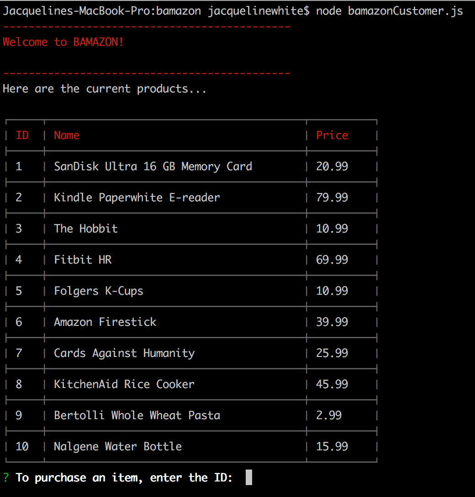
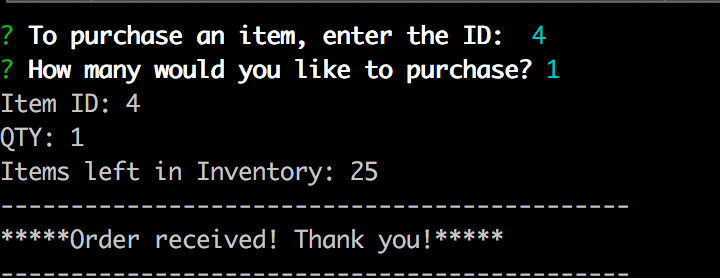
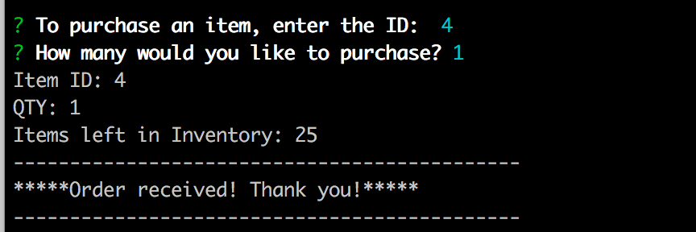
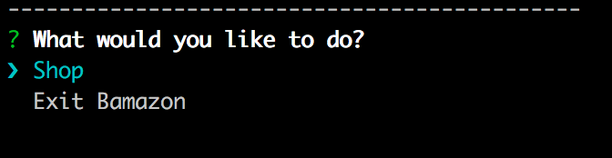

# Bamazon
Overview
An Amazon-like storefront utilizing MySQL.  The app takes in orders from customers and depletes stock from the store's inventory.

Bamazon is a CLI store that takes you through the following process:

1. Welcome to Bamazon, here are the products:(#)

2. Next, enter Product ID to purchase:(#)

3. A function runs to check inventory before the purchase runs.(#) 
  

4. If there is enough in the inventory, the purchase is completed and you can then SHOP or EXIT.(#)
